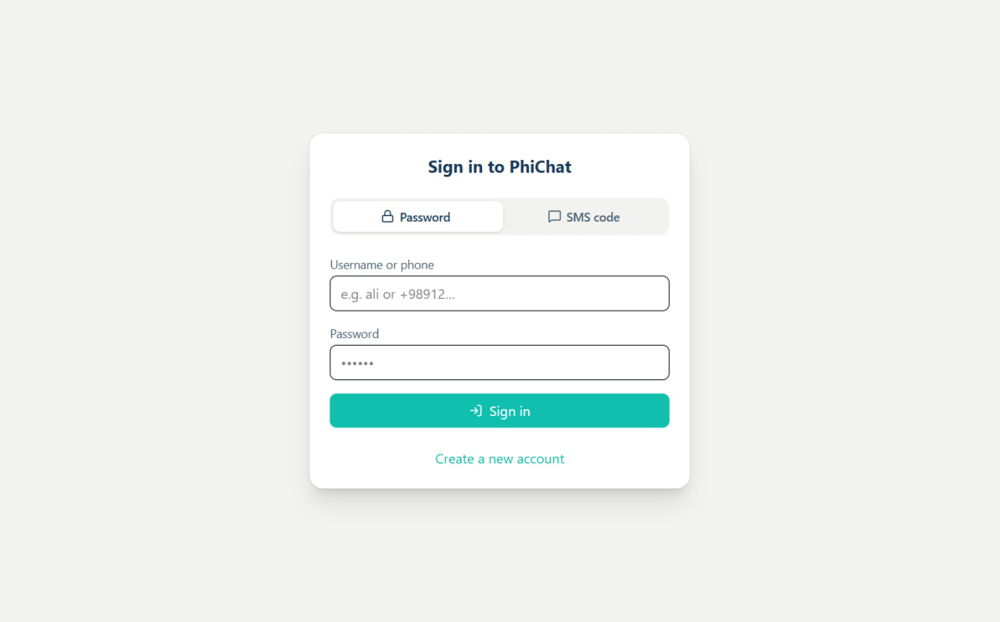
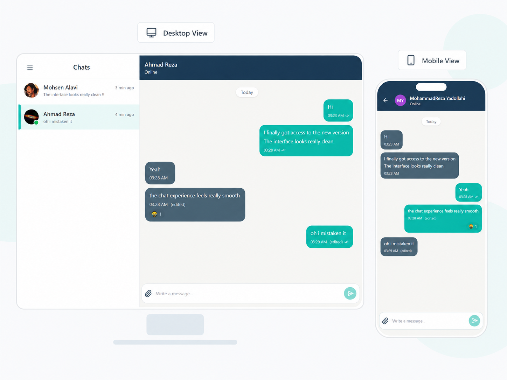
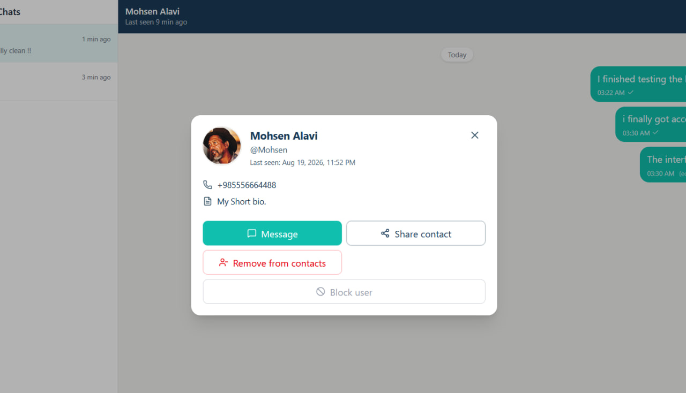

# PhiChat Client

A modern encrypted messaging client built with Vue 3 and TypeScript.

PhiChat Client is the frontend application of the PhiChat messaging
platform. It provides a real-time chat experience with encrypted message
handling, user authentication, media sharing, and a responsive
interface.

## ✨ Features

-   Real-time messaging using SignalR
-   Client-side message encryption with AES-GCM
-   Secure key storage in browser storage
-   User registration and login flows
-   Phone verification support
-   Private conversations and contacts management
-   Message reactions, replies, editing, deletion, and forwarding
-   Image and video message support
-   Responsive chat interface for desktop and mobile
-   Profile and account settings management

## 🔐 Security

PhiChat uses browser-native cryptography APIs for message encryption.

The client includes:

-   AES-256-GCM encryption for message content
-   Random initialization vectors (IV) per encrypted message
-   Local storage management for encryption keys
-   Encrypted communication flow between client and server

> Note: End-to-end encryption security depends on the complete system
> design, including the backend implementation and key management
> strategy.

## 🛠 Tech Stack

-   Vue 3
-   TypeScript
-   Vite
-   Tailwind CSS
-   Vue Router
-   Pinia
-   SignalR
-   Axios
-   Web Crypto API

## 📂 Project Structure

    src/
    ├── components/        # Shared UI components
    ├── features/chat/     # Chat-related components and composables
    ├── services/          # API, authentication, crypto, realtime communication
    ├── views/             # Application pages
    ├── utils/             # Helper functions
    └── router/            # Application routing

## 🚀 Installation

Clone the repository:

``` bash
git clone <repository-url>
cd phichat-client
```

Install dependencies:

``` bash
npm install
```

Run the development server:

``` bash
npm run dev
```

Build for production:

``` bash
npm run build
```

## ⚙️ Configuration

In development the Vite dev server proxies `/api`, `/hubs` and `/uploads`
to the backend, so the app and API share one origin and the HttpOnly
refresh-token cookie stays first-party. The proxy target defaults to
`https://localhost:7146`; to change it, copy `.env.example` to `.env.local`
(ignored by git) and set:

    VITE_DEV_PROXY_TARGET=https://localhost:7146

Only when the API is hosted on a different origin than the app, set:

    VITE_SERVER_ORIGIN=https://your-server-address

(cross-site hosting also needs the backend cookie setting
`Auth:RefreshCookie:SameSite` = `None`).

Sessions use a short-lived access token that is renewed automatically
through `POST /api/auth/refresh`; signing out revokes the session on the
server.

## 🖼 Screenshots








## 🎬 Demo

For showing real-time features, animations, or encryption flow, you can


## 🤝 Backend

This repository contains only the frontend client.

The backend is responsible for:

-   User management
-   Authentication services
-   Message delivery
-   SignalR communication
-   Server-side data handling

## 📌 Status

PhiChat is an active development project focused on building a secure
and modern messaging experience.

## 📄 License

Add your preferred license information here.
